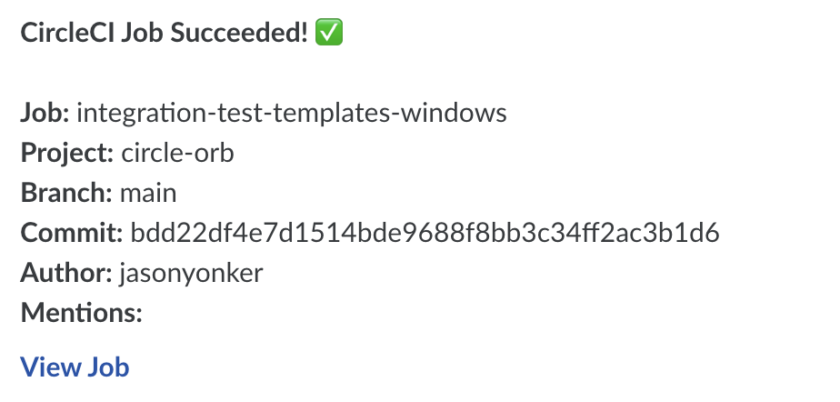
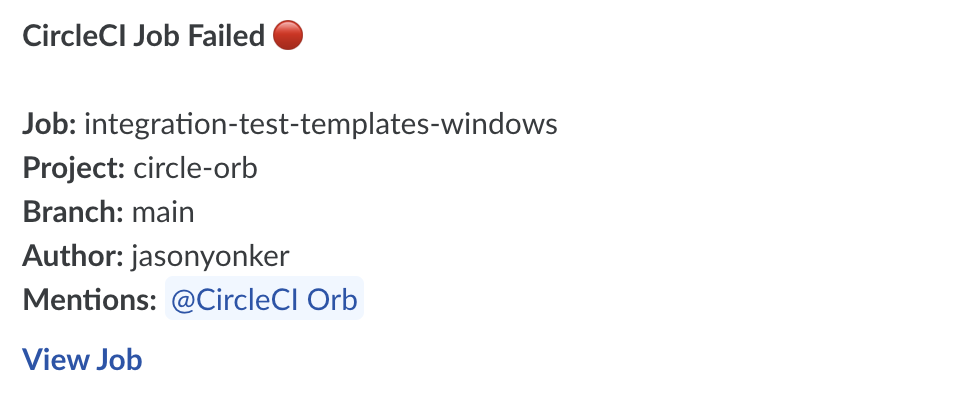
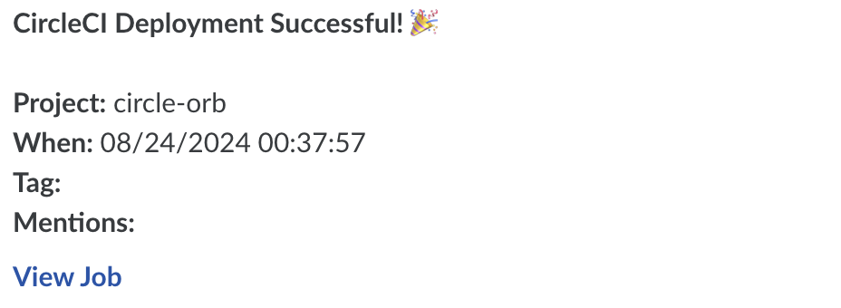
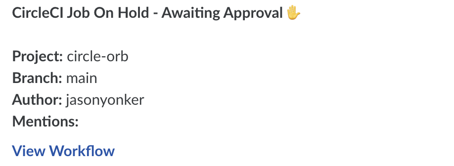

# Glue Orb  [](https://circleci.com/gh/gluegroups/circle-orb) [](https://circleci.com/orbs/registry/orb/gluegroups/glue) [](https://raw.githubusercontent.com/gluegroups/circle-orb/master/LICENSE)

Send Glue notifications from your CircleCI pipelines even easier with the Glue Orb.

## Usage

### Setup

In order to use the Glue Orb on CircleCI you will need to create a Glue webhook and provide its URL. Find the guide in the wiki: [How to setup Glue orb](https://github.com/gluegroups/circle-orb/wiki/Setup)

### Use In Config

For full usage guidelines, see the [Orb Registry listing](http://circleci.com/orbs/registry/orb/gluegroups/glue).

## Templates

The Glue Orb comes with a number of included templates to get you started with minimal setup. Feel free to use an included template or create your own.

| Template Preview  | Template  | Description |
| ------------- | ------------- | ------------- |
|   | basic_success_1   | Should be used with the "pass" event. |
|   | basic_fail_1   | Should be used with the "fail" event. |
|   | success_tagged_deploy_1   | To be used in the event of a successful deployment job. _see orb [usage examples](https://circleci.com/developer/orbs/orb/gluegroups/glue#usage-examples)_ |
|   | basic_on_hold_1   | To be used in the on-hold job. _see orb [usage examples](https://circleci.com/developer/orbs/orb/gluegroups/glue#usage-examples)_  |

## Custom Message Template

  1. Create your desired notification message using markdown.
  2. Replace any placeholder values with $ENV environment variable strings.
  3. Set the resulting text as the value for your `custom` parameter.

  ```yaml
- glue/notify:
      event: always
      custom: |
        **This is a text notification**
  ```

## Branch or Tag Filtering

Limit Glue notifications to particular branches with the "branch_pattern" or "tag_pattern" parameter.

```
A comma separated list of regex matchable branch or tag names. Notifications will only be sent if sent from a job from these branches/tags. By default ".+" will be used to match all branches/tags. Pattern must match the full string, no partial matches. Keep in mind that "branch_pattern" and "tag_pattern" are mutually exclusive.
```

See [usage examples](https://circleci.com/developer/orbs/orb/gluegroups/glue#usage-examples).

## Thread Messages

Create threads for notifications using the `thread_subject` parameter. When using a `thread_subject`, your `target` value must be the group ID where the thread should be created. To send followup messages to the same thread, specify a `thread_by` value. All messages with a given `thread_by` value and group ID will go to the same thread.

```yaml
- glue/notify:
      event: always
      target: grp_ABCXYZ
      thread_by: testing-$CIRCLE_SHA1
      thread_subject: Tests for $CIRCLE_SHA1
      custom: |
        **Tests started.**
- glue/notify:
      event: always
      target: grp_ABCXYZ
      thread_by: testing-$CIRCLE_SHA1
      thread_subject: Tests for $CIRCLE_SHA1
      custom: |
        **Tests finished.**
```

---

## FAQ

View the [FAQ in the wiki](https://github.com/gluegroups/circle-orb/wiki/FAQ)

## Contributing

We welcome [issues](https://github.com/gluegroups/circle-orb/issues) and [pull requests](https://github.com/gluegroups/circle-orb/pulls) against this repository!
